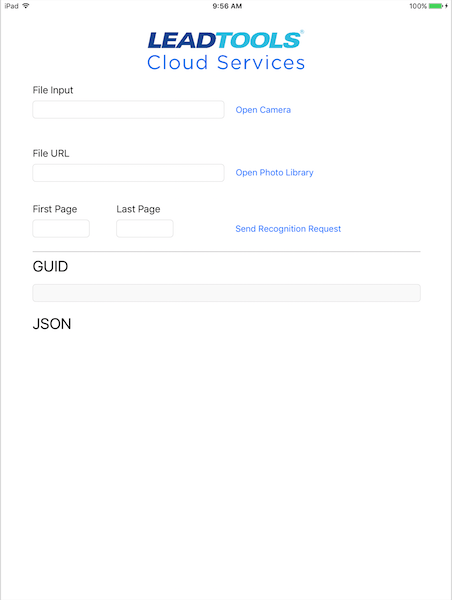

# LTCLoudServicesBarcode
iOS application utilizing the LEADTOOLS Cloud Services web API.

The following project utilizes the LEADTOOLS Cloud Services web API to enable users to recognize images containing barcodes. Users are able to upload a picture via the photo library or take a photo via the camera, or pass a URL to the web service for barcode recognition. In addition to passing the image, users must also provide the first page and last page of their image file they wish to recognize, and the application ID and password for their respective Cloud Services account. 

Once all of the information is provided, UIKit is used to make a URLRequest. A completion handler is used to obtain the GUID that is passed back from the first URLrequest. Once done, a second request must be sent with the returned GUID. Upon completion, the JSON data can be parsed to extract barcode fields such as barcode location, value, symbology, etc.

ViewController contains the application logic. BarcodeModel contains the struct to allow easy parsing of JSON data.

More information can be found at the links below:

Leadtools Cloud Services: https://services.leadtools.com/

Leadtools Cloud Services API Documentation: https://services.leadtools.com/documentation/api-reference

#Note: must have LEADTOOLS Cloud Services Account to run application. Work in Progress(WIP)

